<p align="center">
  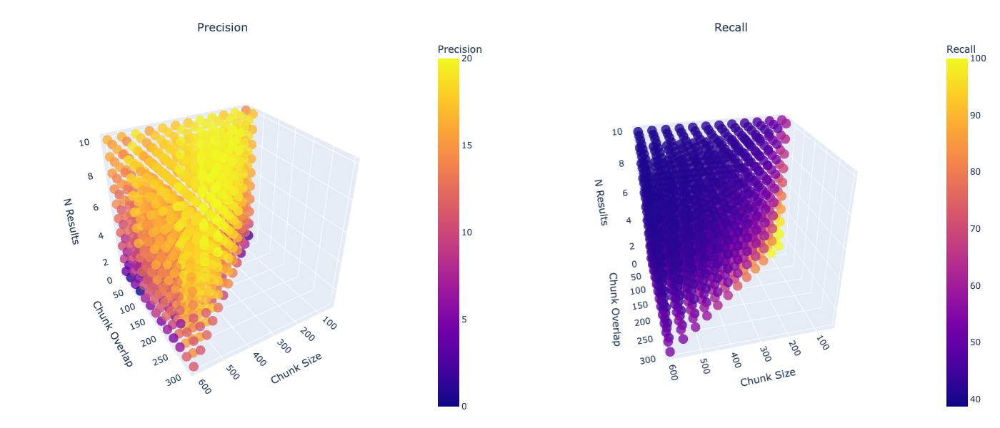
</p>

# Chunking evaluation
## Implementation and run
### Structure
```
.
├── chunker/                     # Chunker
│   ├── __init__.py
│   ├── base_chunker.py
│   └── fixed_token_chunker.py
│
├── data/                        # Corpus and Questions
│   ├── questions_state_of_the_union.csv
│   └── state_of_the_union.md
│ 
├── images/                      # Plots used in README.md
│   ├── ...
│
├── metrics/                     # Recall, Precision, IoU calculation
│   ├── __init__.py
│   ├── calculate_metrics.py
│   └── utils.py
│
├── pipeline/                    # Retrieval pipeline logic
│   ├── __init__.py
│   └── pipeline.py
│
├── main.py                      # Manual experiment runner (for a single config)
├── requirements.txt
├── results_table.csv            # Results of experiments 
├── wandb_train_script.py        # Script for wandb sweeps         
└── README.md                  
```
### How you can run?
To run this project, clone the repository and then install the required dependencies:
```
pip install -r requirements.txt
```
Run the **single experiment** manually with:
```
python main.py
```
### How did I run calculations?
I conducted experiments using Weights & Biases Sweep and saved the computational script as [wandb_train_script.py](https://github.com/polinak1r/Chunking_Evaluation/blob/main/wandb_train_script.py). However, it's also necessary to configure a YAML file, where you need to specify the exact settings for your run and your custom set of hyperparameters. 

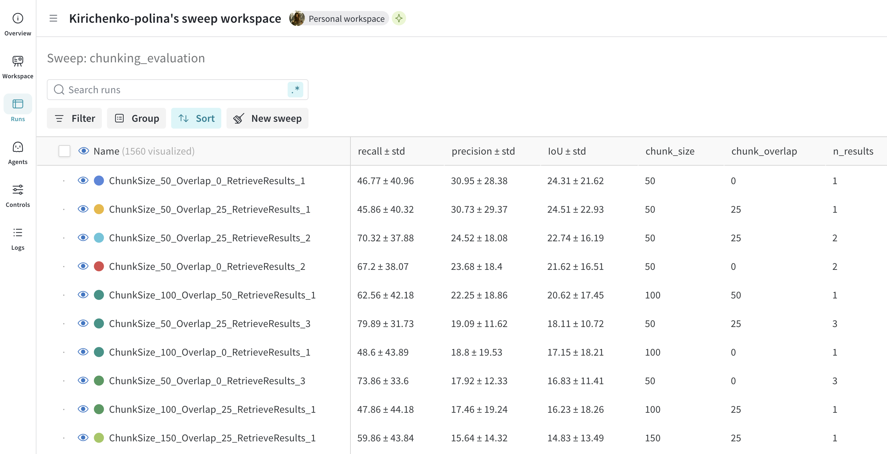

## Choosing the Hyperparameter Range and the First Experiment
In our task, we will vary three hyperparameters for a fixed chunking method:
- `chunk_size`: the size of the chunk
- `chunk_overlap`: the overlap between chunks
- `n_results`: the number of top results retrieved
  
The Chroma paper only provides a small subset of metric values — with `chunk_size = 200, 400, 800` and `overlap` equal to either `1/2 * chunk_size` or `0`. Choosing a `chunk_overlap > 1/2 * chunk_size` indeed doesn’t seem very meaningful, as overlaps would then overlap with each other, resulting in too much redundant context. According to the paper, the best metric results are achieved with `chunk_size` values of 200 and 400, so we will base our range around this - ±200 (starting from `chunk_size = 50`). As a result, I ran computations with the following parameters:
```
method: grid    
parameters:
  chunk_size: 
    values: [50, 100, 150, 200, 250, 300, 350, 400, 450, 500, 550, 600] 
  chunk_overlap:
    values: [25, 50, 75, 100, 125, 150, 175, 200, 225, 250, 275, 300]
  n_results: 
    values: [1, 2, 3, 4, 5, 6, 7, 8, 9, 10]
```

This resulted in **900 valid results** (an additional 660 were skipped due to the condition `chunk_overlap ≤ 1/2 * chunk_size`).
## General overview of precision/recall results
Precision is quite evenly spread, but Recall is different — most values are between 0 and 5. Recall also has a clear upper limit at 30.95, which means the model often adds a lot of redundant information.

There is also a well-known trade-off between precision and recall. When one goes up, the other usually goes down. There is no perfect balance between them, so we usually have to choose which metric is more important for our task.

<p align="center">
  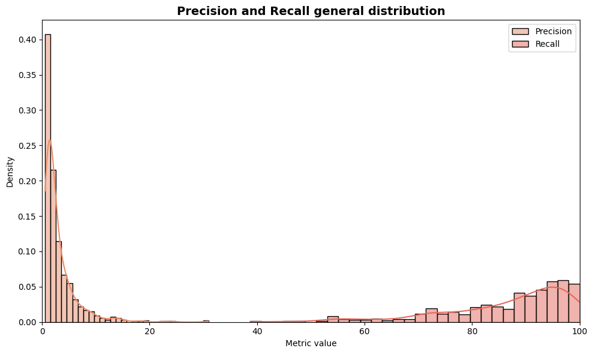
  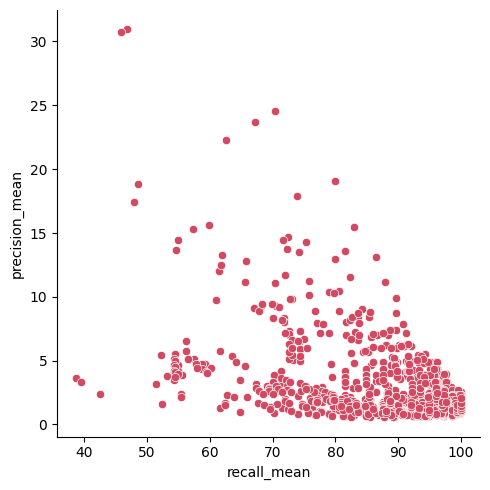
</p>


#  Hyperparameters
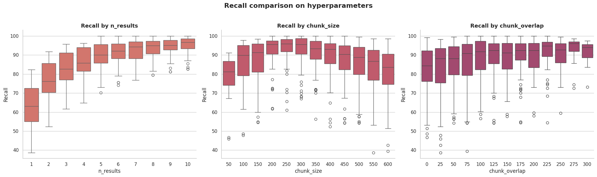
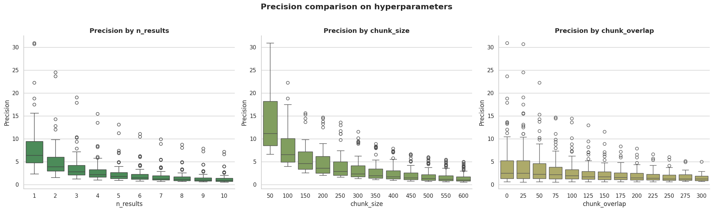

#### n_results

We see that `n_results` has a huge impact on our metrics. When `n_results` increases, Recall grows a lot - especially quickly when going from 1 to 5. Precision, on the other hand, drops fast because we start collecting more "noisy" or irrelevant data. This makes sense: when we choose only a few chunks, they are usually the most relevant, but we probably miss some important information.

#### chunk_size

Increasing `chunk_size` from 50 to 250 improves Recall, but then it starts to decrease. This is interesting, and we should think about why. One possible reason is that most reference answers are shorter than 275 tokens. When the chunk is larger than that, it may become too general. The vector embeddings might start mixing different topics. Also, we must remember that our model cuts off any context longer than its `max_position_embeddings` parameter, which is 512 tokens — so we might be losing some important context.

Precision drops very quickly as `chunk_size` grows, because the larger the chunk, the more likely it includes unrelated information.

#### Let’s formulate and try to test Hypothesis №1 — is the extremum of the Recall/chunk_size plot close to the 90th percentile of the reference answer length distribution?

<p align="center">
  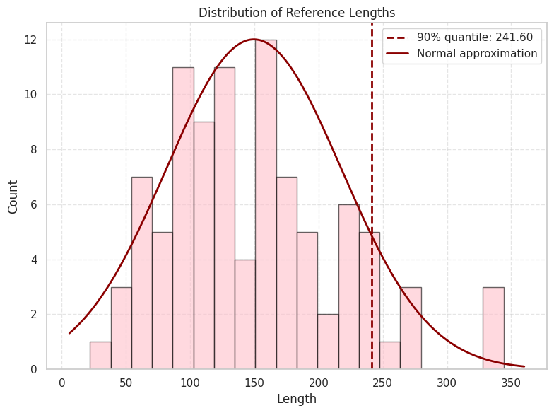
  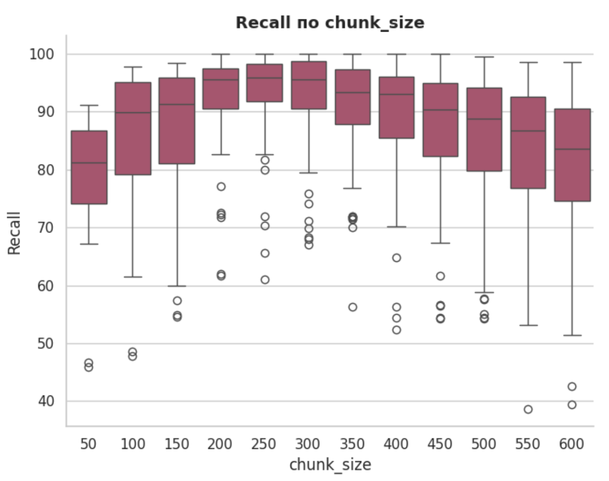
</p>

#### chunk_overlap

I came to the conclusion that maybe `chunk_overlap` gives unstable results in Recall because I didn’t collect the statistics evenly. For example, for chunks of size 50, we only consider `chunk_overlap = 25` (which is 50% of the chunk size), while for chunk size 600, we consider all variations of overlap from 25 to 300 (which is ~4% to 50%).

Let’s look at the plot showing how our metrics depend on the percentage of overlap relative to chunk_size:

<p align="center">
  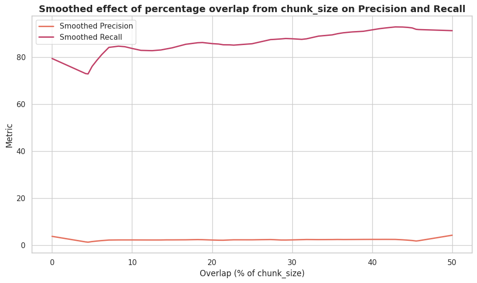
</p>

Visually, it looks like `chunk_overlap` increases Recall and has almost no effect on Precision. Why is there such a sharp jump in Recall around 5%? Because we are looking at percentage overlap (overlap / chunk_size), and 5% overlap only exists for chunk sizes 500, 550, and 600, which already have lower Recall compared to, for example, chunk size 250. And we simply don’t have data for smaller chunk sizes with 5% overlap. The same logic explains the small drop in Precision at the beginning.

#### Let’s call this Hypothesis №2 and test it right away.

## Hypothesis Testing

### Hypothesis №2 - Does chunk_overlap have a small positive effect on Recall and almost no effect on Precision?

We will start with Hypothesis #2, because uneven data distribution might also influence other metrics. To test the hypothesis, let’s collect more data for smaller overlap values, setting them as a percentage of `chunk_size`.

Visually, we can see that `chunk_overlap` has almost no effect on Precision, but slightly increases overall Recall. Why is there a sharp increase in Recall around 5%? Again, because 5% overlap only exists for large chunks (500, 550, 600), which already have lower Recall than, say, chunk size 250. And we have no smaller chunk sizes with 5% overlap in the current data. The small drop in Precision at the beginning can be explained the same way.

To test this hypothesis, let’s compute metrics for smaller overlap values by defining them as a percentage of `chunk_size`:

```
method: grid    
parameters:
  chunk_size: 
    values: [50, 150, 250, 350]
  chunk_overlap:
    values: [0.1, 0.2, 0.3, 0.4, 0.5] # it's %
  n_results: 
    values: [1, 3, 5, 7, 10]
```

Let’s once again look at the relationship between the metrics and the percentage ratio `chunk_overlap / chunk_size`:

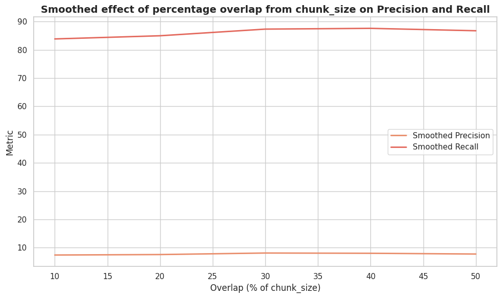

Now we can say that the hypothesis **was confirmed**. The best improvement in Recall is achieved when the overlap is around **30–40%**.

### Hypothesis №1 - Correlation Between the Extremum in the Recall/Chunk_Size Plot and the Reference Length Distribution

The percentage - based approach to overlap showed good results, so now let’s calculate results for more values.

To do this, we divide our dataset into 3 equal parts based on the reference length (and we only consider examples where the number of references is exactly 1 - which is the majority of the data).

We will use the following parameters:

```
method: grid
parameters:
    dataset_sizes = ["small", "middle", "big"]
    chunk_sizes = [50, 100, 150, 200, 250, 300, 350, 400]
    overlap_fracs = [0.1, 0.2, 0.3, 0.4, 0.5]
    n_results_list = [1, 3, 5, 7, 10]
```
 
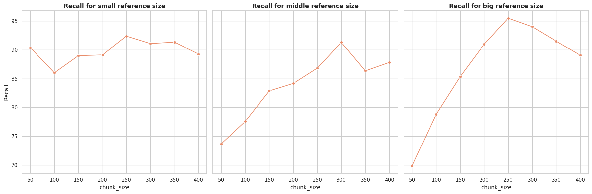
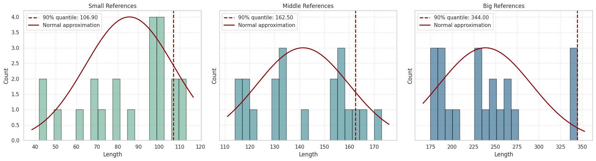
I did not see any connection between the extrema of these plots and the distributions of the reference answer lengths, so the hypothesis was **not confirmed**.

## Results
### Recall best results:

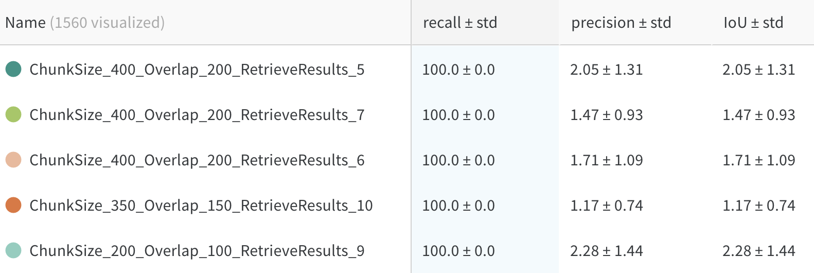


### Precision best results:

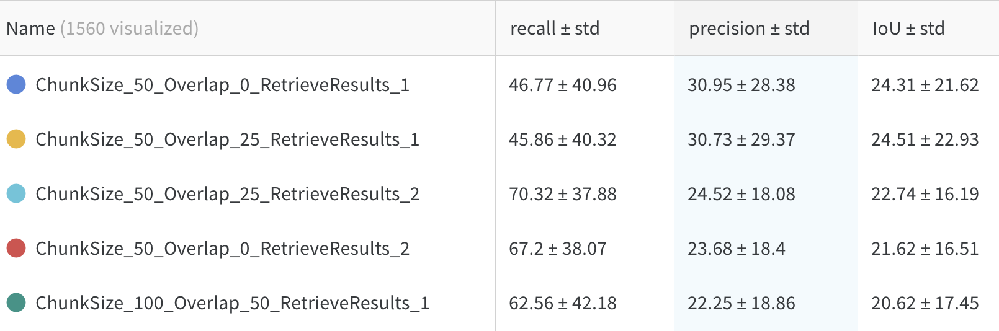
